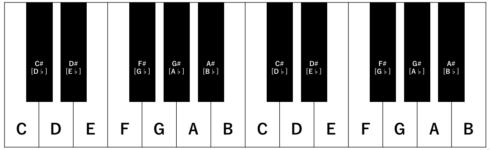

<html lang="ja">
  <head>
    <meta charset="UTF-8">
  </head>
  <body>
    

      <h1>Search Chords Mode</h1>
      

      <h2>調性</h2>
      

      

      <form name="selector">
        <select name="Key">
          <option value="C">C</option>
          <option value="C#">C#</option>
          <option value="D">D</option>
          <option value="D#">D#</option>
          <option value="E">E</option>
          <option value="F">F</option>
          <option value="F#">F#</option>
          <option value="G">G</option>
          <option value="G#">G#</option>
          <option value="A">A</option>
          <option value="A#">A#</option>
          <option value="B">B</option>
        </select>
        <select name="Maj">
          <option value="Major">Major</option>
          <option value="minor">minor</option>
        </select>
      </form>  
     

     
     <input type="button" value="Enter" onclick="entry()">
      <h2>実行結果</h2>
      <table id="move">
        <tr>
          <td>基調、主調(Key Note)</td>
          <td></td>
        </tr>
        <tr>
          <td>同主調(Parallel Key)</td>
          <td></td>
        </tr>
        <tr>
          <td>平行調(Relative Key)</td>
          <td></td>
        </tr>
        <tr>
          <td>属調(Dominant Key)</td>
          <td></td>
        </tr>
        <tr>
          <td>下属調(Subdominant Key)</td>
          <td></td>
        </tr>
        <tr>
          <td>属調平行調</td>
          <td></td>
        </tr>
        <tr>
          <td>下属調平行調</td>
          <td></td>
        </tr>
      </table>      
      

      <h6 align="right">※この検索システムは、個人的にまとめたため、信頼度は低いです。あらかじめご了承ください。</h6>
    

    

      <a href="https://takajo-soft08.github.io/SearchChord/">
         Back To Home
      </a>
    

  </body>
</html>

